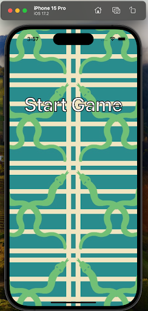
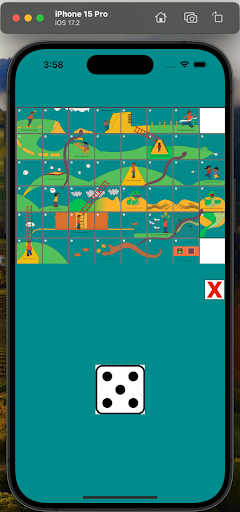
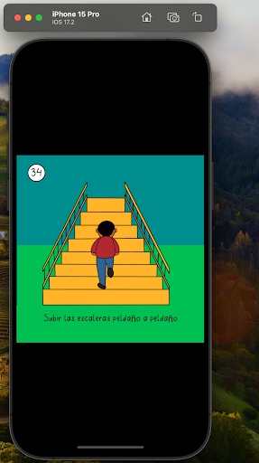
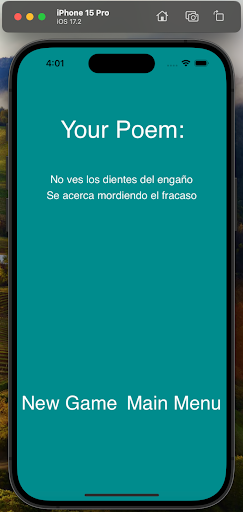

# Social Service iOS Lab Project
**UDLAP iOS Lab**

## About the Project

This project, **Serpientes y Poemas**, is developed as part of the Social Service iOS Lab initiative. It is an iOS application designed to provide an engaging and educational experience by combining the classic game of "Snakes and Ladders" with poetry. The app aims to help children learn and appreciate Mexican poetry in a fun and interactive way. It leverages **SpriteKit** to create a visually appealing and dynamic gameplay experience.

## Features

- Interactive gameplay inspired by "Snakes and Ladders."
- Integration of Mexican poetry to enhance the educational value.
- User-friendly interface designed for iOS devices.
- Built using Swift, Xcode, and SpriteKit for rich graphics and animations.

## Requirements

- macOS with Xcode installed.
- iOS 14.0 or later for deployment.
- Swift 5.0 or later.

## Installation

1. Clone the repository:
    ```bash
    git clone https://github.com/alejandroollivierochoa/Serpientesypoemas.git
    ```
2. Navigate to the project directory:
    ```bash
    cd Serpientesypoemas
    ```
3. Open the project in Xcode:
    ```bash
    open Serpientesypoemas.xcodeproj
    ```
4. Build and run the project on a simulator or a connected iOS device:
    - Select your target device or simulator in Xcode.
    - Press the "Run" button or use the shortcut `Cmd + R`.

## How to Use the App

1. Launch the app on your iOS device.
2. Start a new game by selecting the "Play" button on the main menu.

    
3. Roll the dice to move your token across the board, just like in the classic "Snakes and Ladders" game.

    
4. Land on special tiles to unlock and read Mexican poems, enhancing the educational experience.

    
5. Enjoy the interactive animations and graphics powered by SpriteKit.
6. Reach the end of the game to view a final poem.

    

## Inspiration

This project was inspired by the idea of making learning fun and interactive for children. By combining the timeless board game "Snakes and Ladders" with the beauty of Mexican poetry, the app aims to foster a love for literature and culture in young learners.

## Acknowledgments

Special thanks to the UDLAP iOS Lab for providing the platform and resources to develop this project. The app is a testament to the power of technology in promoting education and cultural appreciation.
